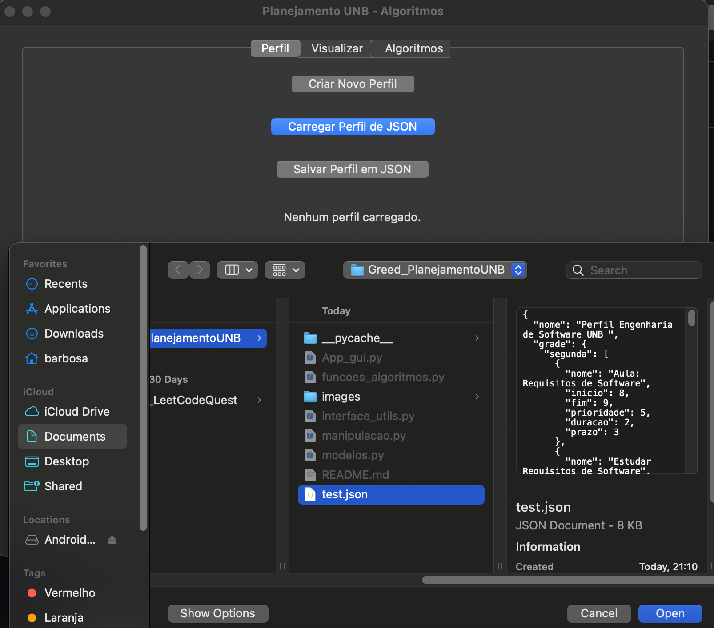
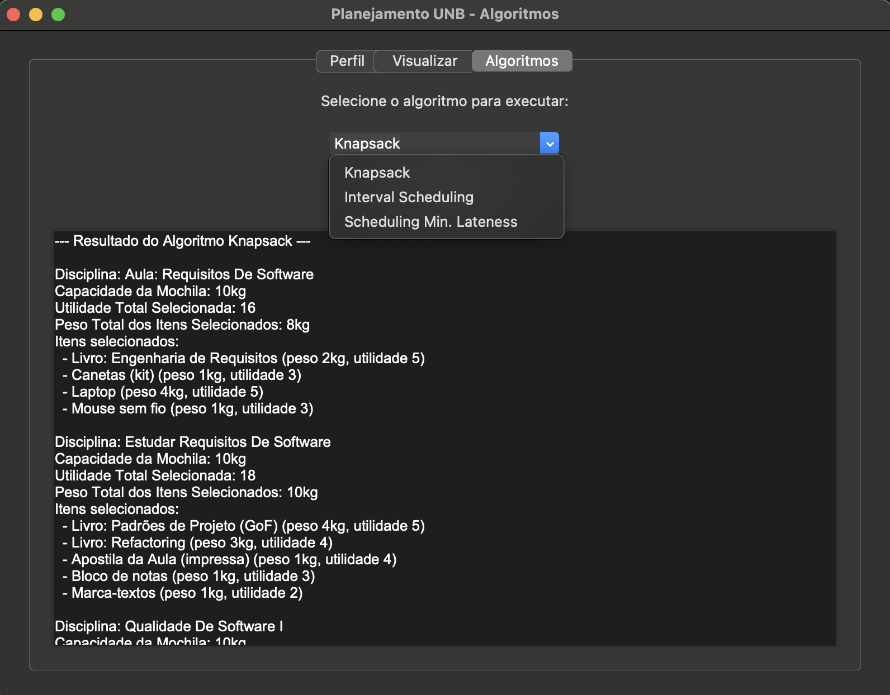

# Planejamento UNB

**Conteúdo da Disciplina**: Algoritmos Ambiciosos <br>

## Alunos

| Matrícula  | Aluno                       |
| ---------- | --------------------------- |
| 20/0026151 | Pedro Henrique F. Nunes     |
| 18/0042041 | Gustavo Barbosa de Oliveira |

## Sobre

Planejamento UNB é um algoritmo para organizar e otimizar o planejamento semanal dos estudantes, integrando disciplinas, materiais e tarefas em um perfil personalizado.

O sistema utiliza algoritmos de otimização para ajudar a distribuir materiais e tarefas de forma eficiente ao longo da semana, garantindo melhor aproveitamento do tempo.

Algoritmos principais utilizados:

- Knapsack: Este algoritmo te ajuda a selecionar os materiais mais importantes para levar, garantindo que você maximize o valor (ou a utilidade) dentro da capacidade disponível, seja ela física ou de tempo.
- Interval Scheduling (Agendamento de Intervalos): O Interval Scheduling agenda suas tarefas de forma a não haver sobreposição, maximizando o uso do seu tempo disponível e garantindo que você consiga cumprir o máximo de atividades possível em um dia.
- Scheduling with Minimum Lateness (Agendamento com Latência Mínima): Ele organiza a sequência das suas tarefas para minimizar o atraso daquela que mais pode te prejudicar, priorizando o que precisa ser feito para evitar ou reduzir multas e problemas por entregas fora do prazo.

<!-- Descreva os objetivos do seu projeto e como ele funciona. -->

## Instalação e Uso

Para configurar o Planejamento UNB em sua máquina, siga os passos abaixo:

#### Clone o repositório:

1. Clone o repositório:

   ```bash
   https://github.com/projeto-de-algoritmos-2025/Greed_PlanejamentoUNB.git
   ```

   2.Acesse o diretório do Projeto:

   ```bash
   cd Greed_PlanejamentoUNB
   ```

   3.Após a instalação, você pode iniciar o Planejamento UNB executando o script principal no terminal:

   ```bash
   python App_gui.py
   ```

   **Linguagem**: Python3

2. Para melhor teste de caso recomendamos utilizar o arquivo test.json. Basta carregar o arquivo na aplicação.



<!-- Descreva os pré-requisitos para rodar o seu projeto e os comandos necessários -->

### Screeshots

1. Tela Principal


2. Criar Perfil
   

3. Interface dos algoritmos
   

4. Estrutura do código
   

5. Modelos CLI
   
